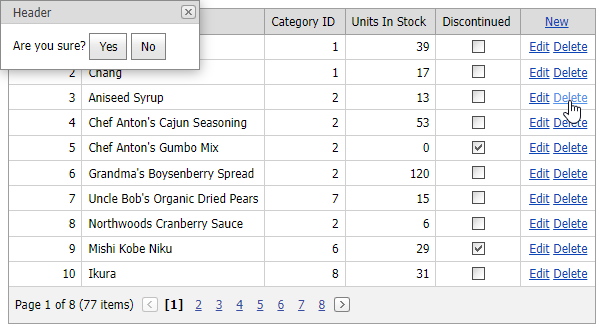

<!-- default badges list -->

[](https://supportcenter.devexpress.com/ticket/details/T103862)
[](https://docs.devexpress.com/GeneralInformation/403183)
<!-- default badges end -->
# GridView for Web Forms - How to use ASPxPopupControl to show a confirmation dialog




In this example, the [ASPxGridView](https://docs.devexpress.com/AspNet/DevExpress.Web.ASPxGridView) control contains a custom **Delete** button. 

```aspx
<dx:GridViewCommandColumn ShowNewButtonInHeader="true" ShowEditButton="true">
    <CustomButtons>
        <dx:GridViewCommandColumnCustomButton ID="deleteButton" Text="Delete" />
    </CustomButtons>
</dx:GridViewCommandColumn>
```

The client [CustomButtonClick](https://docs.devexpress.com/AspNet/js-ASPxClientGridView.CustomButtonClick) event handler shows [ASPxPopupControl](https://docs.devexpress.com/AspNet/DevExpress.Web.ASPxPopupControl) when a user clicks the **Delete** button.

```js
function OnCustomButtonClick(s, e) {
    visibleIndex = e.visibleIndex;
    popup.Show();
}
```

```aspx
<dx:ASPxPopupControl ID="ASPxPopupControl1" runat="server" Text="Are you sure?" ClientInstanceName="popup">
    <ContentCollection>
        <dx:PopupControlContentControl>
            <dx:ASPxButton ID="yesButton" runat="server" Text="Yes" AutoPostBack="false">
                <ClientSideEvents Click="OnClickYes" />
            </dx:ASPxButton>
            <dx:ASPxButton ID="noButton" runat="server" Text="No" AutoPostBack="false">
                <ClientSideEvents Click="OnClickNo" />
            </dx:ASPxButton>
        </dx:PopupControlContentControl>
    </ContentCollection>
</dx:ASPxPopupControl>
```

When a user clicks the **Yes** button, the [Click](https://docs.devexpress.com/AspNet/DevExpress.Web.ASPxButton.Click) event handler calls the [DeleteRow](https://docs.devexpress.com/AspNet/js-ASPxClientGridView.DeleteRow(visibleIndex)) method.

```js
function OnClickYes(s, e) {
    grid.DeleteRow(visibleIndex);
    popup.Hide();
}
function OnClickNo(s, e) {
    popup.Hide();
}
```

## Files to Look At

- [Default.aspx](./CS/Default.aspx) (VB: [Default.aspx](./VB/Default.aspx))

## More Examples

- [GridView for MVC - How to show a confirmation dialog using PopupControl](https://github.com/DevExpress-Examples/gridview-how-to-show-a-confirmation-dialog-using-popupcontrol-t116360)
- [Popup Control for Web Forms - How to implement a delete confirm dialog with a "Don't ask me again" option](https://github.com/DevExpress-Examples/how-to-implement-a-delete-confirm-dialog-with-a-dont-ask-me-again-option-e1120)
